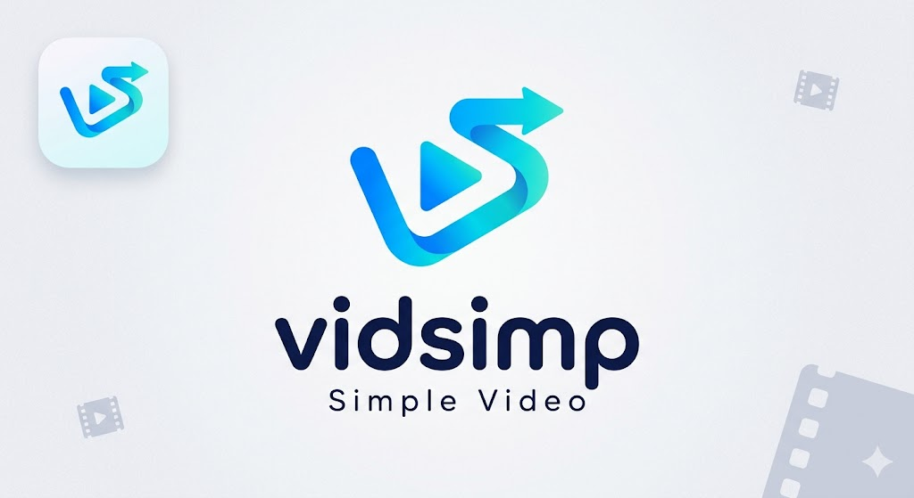

# VidSimp


VidSimp is a robust, production-ready video player application for Linux, specifically optimized for Arch Linux and the Steam Deck. It is built as a clean, single-file Python script (`vidsimp.py`) with its dependencies clearly defined, focused on providing an immersive and touch-friendly viewing experience.

## One-Step SteamOS Installation

If you are using a Steam Deck or a SteamOS machine, you can install VidSimp in Desktop Mode with a single command. Open your terminal (Konsole) and run:

```bash
curl -sSL https://raw.githubusercontent.com/pmitchell-dev/VidSimp/master/install.sh | bash
```

**What the installer does:**
- Clones the repository to `~/VidSimp`.
- Creates an isolated Python virtual environment to keep your SteamOS pristine.
- Installs all dependencies automatically.
- Generates a desktop shortcut (`vidsimp.desktop`) in your application menu. 

Once installed, you can launch it directly from the Application Menu in Desktop Mode, or open Steam and add `VidSimp` as a Non-Steam Game to launch it seamlessly in Gaming Mode!

---

## Key Features

- **Interactive Fullscreen OSD:**
  - Double-clicking the video enters immersive fullscreen mode.
  - A sleek, semi-transparent On-Screen Display (OSD) slides up when you move the mouse or touch the screen.
  - The controls automatically fade away after 3 seconds of inactivity to give you an uninterrupted viewing experience.

- **Playback Memory:**
  - VidSimp remembers exactly where you left off. If you close the app or switch to another video, it automatically saves your progress.
  - The next time you open that video, it seamlessly resumes right from that spot. (Videos watched past 95% will reset to the beginning).

- **Touch-Friendly UI & Kinetic Scrolling:**
  - The video carousel supports kinetic scrolling—just click and drag (or swipe) left and right to glide through your videos.
  - Buttons and list items use standard media icons and have a generous minimum size for easy touch targets on the Steam Deck.
  - Full controller support with `Qt.FocusPolicy.StrongFocus` so elements can be seamlessly navigated via a D-Pad.

- **Dynamic Video Carousel:**
  - Automatically extracts and displays video thumbnails using `ffmpeg` asynchronously via a background thread, preventing UI lag.
  - Filenames wrap cleanly underneath the thumbnails.

- **Persistent Directory Memory & Continuous Queue:**
  - Integrated `QSettings` to remember the last opened video directory. Upon booting, it will automatically populate the carousel.
  - A background system detects when a video ends and automatically increments to the next item in the carousel to begin playback.

- **Rock-Solid Playback Engine:**
  - Built using `PyQt6` and `python-vlc` for cross-platform support.
  - Forces Direct3D9 video output on Windows for flawless Qt embedding and avoids hardware acceleration crashes on certain GPUs.

## Manual Installation

1. Install the Python dependencies:
```bash
pip install -r requirements.txt
```
*Note: `ffmpeg` is required to be installed on your system for thumbnail extraction.*

2. Run the application:
```bash
python vidsimp.py
```
